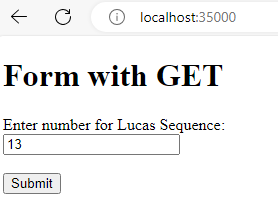
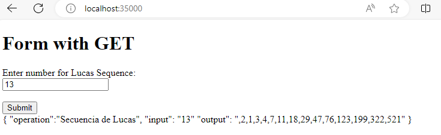
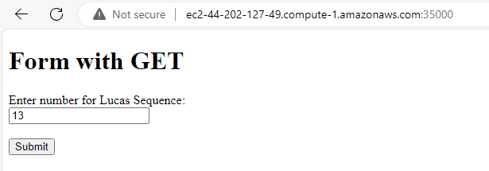

# Parcial Tercio 2 - AREP
## Isabella Manrique

Programa basado en un proxy que funciona como balanceador de cargas que se encarga de
redirigir las peticiones que el cliente reliza desde el browser para poder obtener una
secuencia de numeros correspondiente a su consulta.

La secuencia de numeros se comporta asi:

    L(0)=2
    L(1)=1
    L(n)=L(n−1)+L(n−2), para un n≥2

## ¿Que se necesita para usar este proyecto?
- Git
- Maven
- Java
- Una cuenta de Amazon que permita crear maquinas EC2

## ¿Como funciona?

Si colocamos a correr el servicio de MathService y SparkWebService y nos dirigimos a http://localhost:35000/
encontraremos la siguiente pantalla:

Si apretamos en el boton de enviar con el numero 13, nos aparecera la siguiente respuesta:

Montando los servicios respectivos en la nube, ingresamos el dns asignado a la maquina proxy
podremos encontrar de nuevo nuestro servicio:

## Arquitectura
De forma local, el servicio que nos muestra la pantalla principal es la clase **SparkWebServer** el cual se
conecta al servicio en la clase MathService por medio de la clase de HttpConnection quien alli realiza la 
distribucion de peticiones por medio del algoritmo de RoundRobin. El calculo de as secuencias se delega a la
clase de LucasSequence.

En la nube tendremos tres maquinas EC2 corriendo, una de ellas será el Proxy y en el estaran las clases de
SparkWebServer y HttpConnection, en las otras dos maquinas encontraremos las clases de MathService y LucasSequence
que nos permitiran calcular la sequencia respectiva.